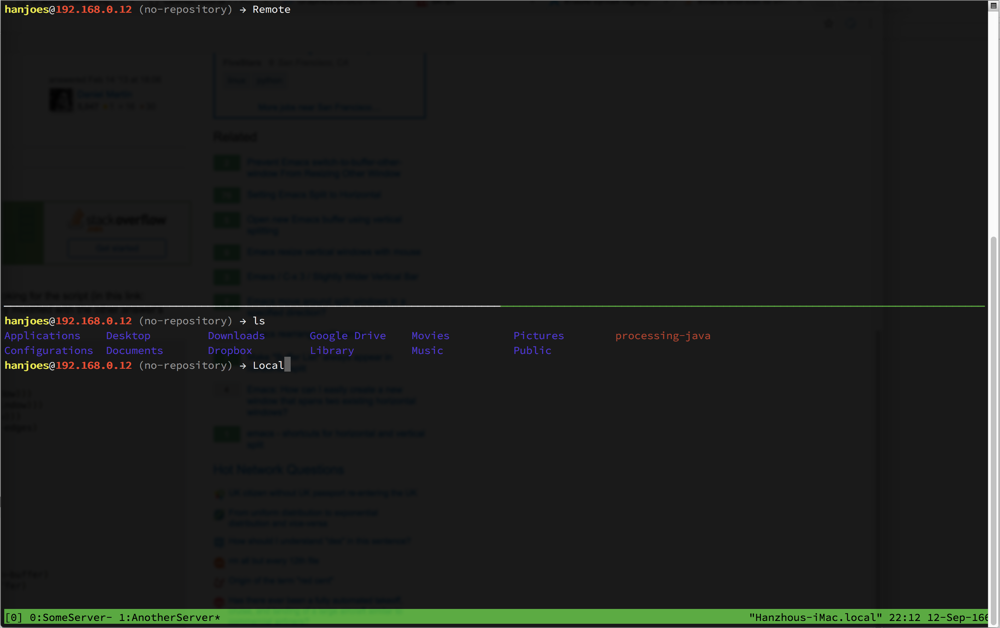
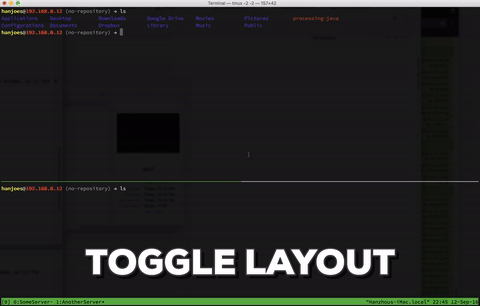
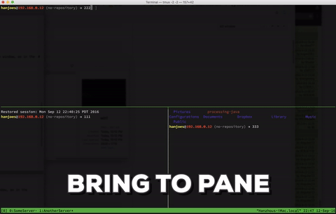
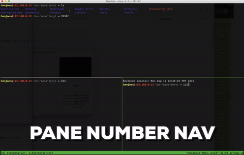
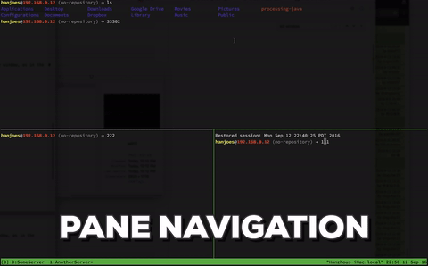

# TmuxGettingStartedGuide

## Basics

### How to Start Tmux

In your terminal, run:

`tmux -2`

I put this in my terminal start script so each time I open my terminal tmux is ready.

### Conrol

If you've used emacs, you should know the idea of **meta key** (or **prefix** in tmux terminology). Basically it is a key combination that starts a command.
In tmux, the meta key is **ctrl+b**, and we will use **C-b** throughout the guide to represent the tmux meta key.

## Level of Management 

I'm not a hardcore tmux user, I mostly use tmux to do some window/pane management. Tmux also has very strong session management functionalities. For users interested in session management, please check out the references section.

### Session

**Session** though is not elaborated in this guide, you should at least know that it's the highest level of the tmux management hierarchy. A session basically manages the current working context (including windows, and more..).

### Window

The second level in the hierarchy is **windows**, a session could contain multiple windows. I usually work on this level. For example, I'm working on some server code and want to deploy that server to remote machine and check logs. I will create a window for all workflow for that server. And split the window into **panes** (which will describe later). In this case each window is a workspace. As shown in the picture below:

You will notice there is a green bar at the bottom of the terminal window. And as you will see, there are two windows open. The window index starts from 0, as in the screenshot, the first window is named *SomeServer* and the second is named *AnotherServer*.

There are several commands need to mentioned here.

`C-b c : Create a window.`

`C-b , : Rename the current window.`

`C-b & : Kill the current window (which i never use).`

`C-b w : List all the windows.`

`C-b n : Next window.`

`C-b p : Previous window.`

`C-b <NUM> : Navigate to the window with index NUM. (Handy when you have a lot of windows)`

And in case you want to reorder your windows:

`swap-window -s <source> -t <target>`

### Pane

The third level of the hierarchy is **panes**, basically everything is rendered in the pane. And you can create more panes by splitting the window, as in the picture above.

The two commands take-away here are:

`C-b " : Horizontally split the pane.`

`C-b % : Vertically split the pane.`

And you can also re-layout the panes by using:

`C-b space : Toggle vertical/horizontal.`

`C-b C-o : Bring the next pane to current pane.` 

`C-b q : Display number for each pane in current window. And pressing the number will navigate you to the pane.`

`C-b o : Navigate to next pane.`
`C-b <arrow-key> : Navigate to the specified direction.`

And...that's it! 
If you are able to bring all those commands to your daily toolbox, you will get a very neat control of your workspaces.

FYI, tmux is a **VERY** powerful tool, you can also detach/attach sessions, break/join panes from/to window, etc, etc. 
If you are interested, there are a lot of great resources on the web, just start from the references below!

## References

[Workflow in Tmux](https://coderwall.com/p/_g2vpq/workflow-in-tmux) Gives some handy examples of tmux workflows.
